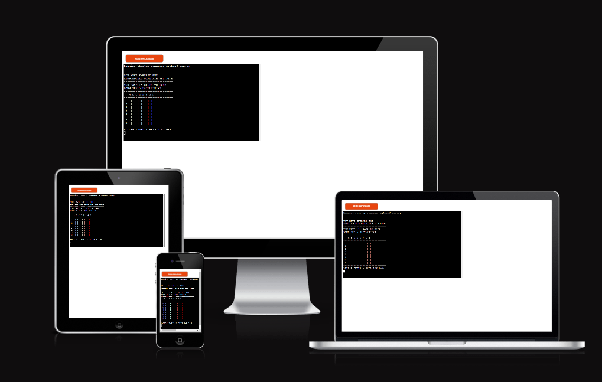
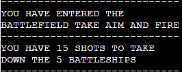
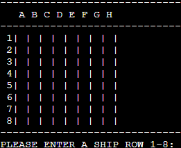
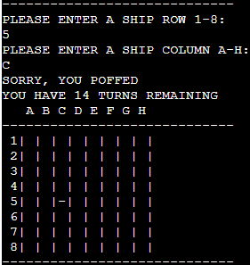
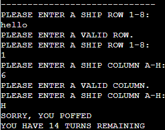

# Battleship Conqueror

Battleship Conqueror is a Python terminal game. It runs in the Code institute mock terminal on Heroku. 
The goal is to take out the Battleships on the board before your ammunition runs out. There are 5 ships hidden from the radar wich the unser needs to find.

[This is a link to the game](https://battleshipsgame.herokuapp.com/) 

 

# How to play

Battleships in this case is played aginst a random generated battlefiled. 
Your goal is to destroy all the battleships before your turns runs out. 
If you hit a ship the board is marked with a x and if you miss it is marked by a -. 
You will have 15 rounds to conquer the battlefield by taking down the 5 ships.

# Game functions

**Game instructions:**  

Gives the user short info about the game 

**Random board generation:**

2 bords is generated one hidden wich contains the 5 battleships and the other is a blank one that keeps track och the users actions.

**Tracking correct user input:**

Checking if the user have entered a correct row and column also checks for repeat inputs.
Tracks the number of hits by the user and the turns remaining before losing the game if the user havent destoyed all ships before then.
 

.

# Testing
**My testing involves:**

- Tested in local terminal and in Code Institute Heroku terminal both played through several times without any issue.
- Passed the code through: https://pep8ci.herokuapp.com/ without any errors.
- Given invalid inputs by providing strings when numbers are needed and vice versa. Also given same input twice.

# Deployment

This project was deployed using Code Institutes mock terminal for Heroku.

**To deploy do the following:**

- Fork or clone this repository
- Create a new Heroku app
- Set buildpacks to Python and NodeJS respectively
- Link the Heroku app to the correct repository
- Then click deploy 

# Credits

- Code institute for the deployment terminal 
- https://www.youtube.com/watch?v=rRTjPnVooxE for helping with while loop.
- The Slack community for feedback on the project.
- Also a shout out to my mentor for helping with planning.