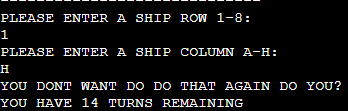

<h1>Battleship Conqueror</h1>

Battleship Conqueror is a Python terminal game. It runs in the Code institute mock terminal on Heroku. 
The goal is to take out the Battleships on the board before your ammunition runs out. There are 5 ships hidden from the radar wich the unser needs to find.

[This is a link to the game](https://battleshipsgame.herokuapp.com/) 

 
<h1>Game functions</h1>

Game instructions: 
Gives the user short info about the game 

Random board generation:
  2 bords is generated one hidden wich contains the 5 battleships and the other is a blank one that keeps track och the users actions.

Tracking correct user input:
 Checking if the user have entered a correct row and column also checks for repeat inputs.
Tracks the number of hits by the user and the turns remaining before losing the game if the user havent destoyed all ships before then.
 

.